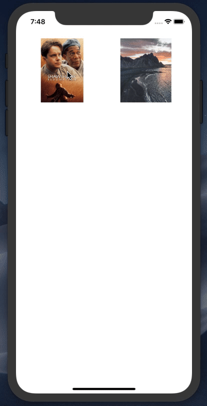
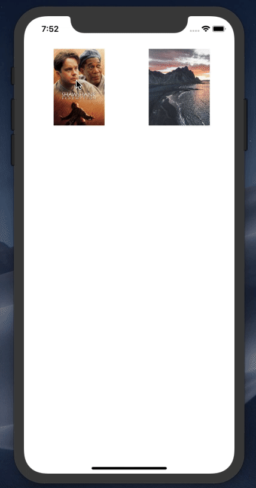
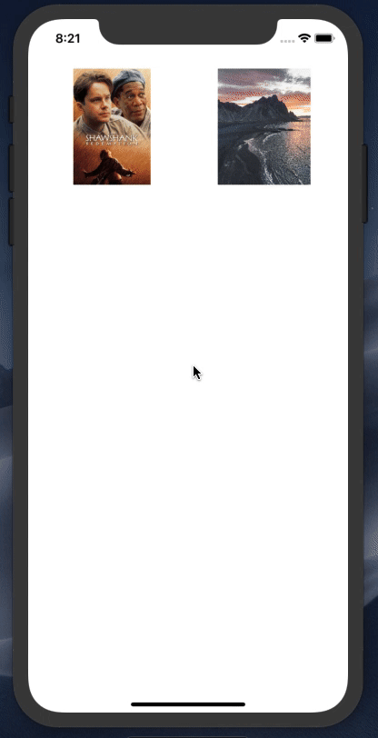
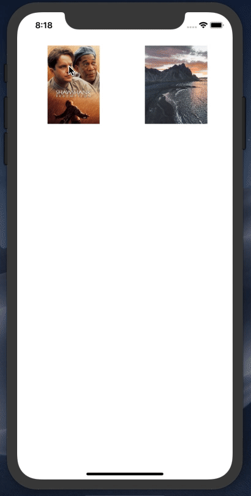
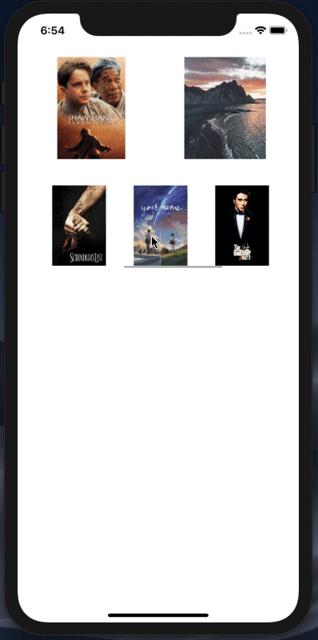

# Leon
leon is a ios library written with swift to enable developer to handle show images with animation and with more gesture

# Installation

### CocoaPods

[CocoaPods](https://cocoapods.org) is a dependency manager for Cocoa projects. For usage and installation instructions, visit their website. To integrate `Leon` into your Xcode project using CocoaPods, specify it in your `Podfile`:

```ruby
pod 'Leon', '~> 0.0.1'
```

# Usage


## How to get image frame

### if container of image is UIView or UIStackView 
```swift
// get point of image
let point = imageView.convert(imageView.bounds.origin, to: self.view /* view is parent view in viewController */ )
// get size of image
let size = CGSize(width: imageView.frame.width , height: imageView.frame.height)
// get frame of image 
let frame = CGRect(origin: point , size: size )
```


There are 6 init funtions in Leon Images

### First init
  

``` swift
// 1- first init
let vc = LeonImages(image: imageView.image!)
self.present(vc , animated: true )
```

*  image: just pass image in imegView without starter animation
- use this init if u have image as just UIImage and don't need to load image from web


<br/>
<br/>
<br/>
<br/>
<br/>
<br/>
<br/>


### Second init


```swift
//2- second init
let vc = LeonImages(imageURL: String )
self.present(vc , animated: true )
````
* imageURL:  is a string url of image to load from web without starter animation
- use this init if you don't want start animation

<br/>
<br/>
<br/>
<br/>

### Third init


```swift
// 3- third init
let vc = LeonImages(listImagesURL: [Any] , index : 2 )
self.present(vc , animated: true )
````
* listImagesURL : an array that contain two type of images 
    - array may contain string url image to load from web
    - array may contain UIImage to just set this image in imageView in LeonImages
* index  ( optional -> default value = 0 ) : the index for starter image in array

<br/>
<br/>
<br/>
<br/>


### Fourth init


````swift
// 4- fourth init
let vc = LeonImages(startFrame: imageView.frame , startImage: imageView.image! , imageURL: String )
self.present(vc , animated: true )
````
- Use this init to start Leon with animation from start fram to center of screen
*  startFrame :  init frame of image to start frame from this point
* startImage : init UIImage in imageView untile animation finished
* imageURL : start load image after animation finish 

<br/>
<br/>
<br/>
<br/>

### Fifth init


```swift
// 5- fifth init
let vc = LeonImages(startFrame: imageView.frame , startImage: imageView.image! )
self.present(vc , animated: true )
```
- Use this init to start Leon with animation from start fram to center of screen
*  startFrame :  init frame of image to start frame from this point
* startImage : init UIImage in imageView untile animation finished

<br/>
<br/>
<br/>
<br/>


### Sixth init


```swift
// 6- Six init
let vc = LeonImages(startFrame: imageView.frame , startImage: imageView.image!, listImagesURL: [Any] , index : 2 )
self.present(vc , animated: true )
```
*  startFrame :  init frame of image to start frame from this point
* startImage : init UIImage in imageView untile animation finished
* listImagesURL : an array that contain two type of images 
- array may contain string url image to load from web
- array may contain UIImage to just set this image in imageView in LeonImages
* index  ( optional -> default value = 0 ) : the index for starter image in array

<br/>
<br/>
<br/>
<br/>

# Features

<p>



- change error message when loading failure (default value : "Error loading, tap to reload" )
```swift
let vc = // use init LeonImages
vc.errorMessage = "write your message"
```
- enable / disable tap to reload when loadin failure
```swift
let vc = // use init LeonImages
vc.tapToReload = true
```
</p>


- dismiss image by panGesture
- zoom image with pinch gesture
- zoom image with double tap
- create custom View Controller extended LeonImages

  ### Example of CustomLeonImages
  
  
  
```swift

import UIKit

class CustomLeonImages : LeonImages {

    var isTapped = false
 
    // creating topView
    lazy var headerView : UIView = {
        let v = UIView()
        v.backgroundColor = #colorLiteral(red: 0.2470588235, green: 0.7725490196, blue: 0.9411764706, alpha: 0.5)

        let b = UIButton()
        b.setTitle("close", for: .normal)
        b.addTarget(self , action: #selector(dismissController), for: .touchUpInside )
        v.addSubview(b)
        b.translatesAutoresizingMaskIntoConstraints = false
        b.topAnchor.constraint(equalTo: v.safeAreaLayoutGuide.topAnchor , constant: 16).isActive = true
        b.leadingAnchor.constraint(equalTo: v.leadingAnchor , constant: 16).isActive = true

        let l = UILabel()
        l.text = "Title Header"
        l.textColor = .white
        v.addSubview(l)
        l.translatesAutoresizingMaskIntoConstraints = false
        l.centerXAnchor.constraint(equalTo: v.centerXAnchor , constant: 0).isActive = true
        l.centerYAnchor.constraint(equalTo: v.centerYAnchor , constant: 0).isActive = true
        return v
    }()

    // creating bottomView
        lazy var footerView : UIView = {
        let v = UIView()
        v.backgroundColor = #colorLiteral(red: 0.2588235294, green: 0.8705882353, blue: 0.8823529412, alpha: 0.5)

        return v
    }()


    override func viewDidLoad() {
        super.viewDidLoad()

        // add header view and footerView on view
        self.view.addSubview(headerView)
        self.view.addSubview(footerView)

        // set constraints for headerView
        headerView.translatesAutoresizingMaskIntoConstraints = false
        headerView.topAnchor.constraint(equalTo: self.view.topAnchor , constant: 0).isActive = true
        headerView.leadingAnchor.constraint(equalTo: self.view.leadingAnchor, constant: 0).isActive = true
        headerView.trailingAnchor.constraint(equalTo: self.view.trailingAnchor , constant: 0).isActive = true
        headerView.heightAnchor.constraint(equalToConstant: 150).isActive = true
        // set constraints for footerView
        footerView.translatesAutoresizingMaskIntoConstraints = false
        footerView.bottomAnchor.constraint(equalTo: self.view.bottomAnchor , constant: 0).isActive = true
        footerView.leadingAnchor.constraint(equalTo: self.view.leadingAnchor , constant: 0).isActive = true
        footerView.trailingAnchor.constraint(equalTo: self.view.trailingAnchor , constant: 0).isActive = true
        footerView.heightAnchor.constraint(equalToConstant: 150).isActive = true

    }

    @objc private func dismissController(){
        self.dismissLeon()
    }


    override func singleTapped() {
        if !isTapped {
            isTapped = true
            startPanGesture()
        }else {
            isTapped = false
            returnImageToCenter()
        }

    }


    // get pageIndex that appear on leonImages
    override var pageIndex: Int {
        didSet {
        print("pageIndex : \(self.pageIndex)")
        }
    }
    // excute this function when user began move with panGesture
    override func startPanGesture() {
        UIView.animate(withDuration: 0.3 ) { [weak self] in
            self?.headerView.alpha = 0
            self?.footerView.alpha = 0
        }
    }
    // excute this function when use leave panGesture and image return in center of screen
    override func returnImageToCenter() {
        UIView.animate(withDuration: 0.3 ) { [weak self] in
            self?.headerView.alpha = 1
            self?.footerView.alpha = 1
        }
    }
}

 
```
## Author
### Yusef Naser

- [Twitter](https://twitter.com/yusef_naser93)
- [GitHub](https://github.com/Yusef-Naser)
- [Linkedin](https://www.linkedin.com/in/yusef-naser-485b7710a)


## License
`Leon` is available under the MIT license. See the [LICENSE](./LICENSE) file for more info.

